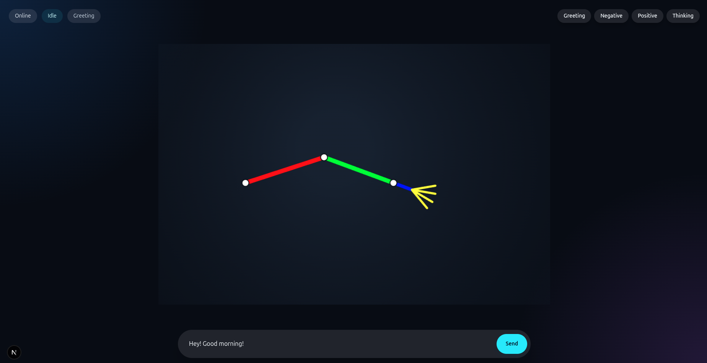

# Hello Hands

Hello Hands is a hybrid Python and Next.js project that simulates a two-bone inverse-kinematics robot arm with a wrist and four claw fingers.


The project started as a desktop PySide6 simulation and was later extended into a server-driven real-time web experience. The current architecture supports:

- Local PySide6 desktop visualization
- Flask API server
- Socket.IO frame streaming
- Normalized coordinate simulation payloads
- Next.js frontend canvas rendering
- JSON animation presets
- Ollama-powered text analysis using IBM Granite
- MCP tooling for external tool clients

---

## Project Goals

The main goal is to create a controllable robot arm simulation that can respond to user intent.

A user can:

1. Run the original PySide6 desktop application.
2. Trigger predefined robot arm animations.
3. Send natural-language text from the web frontend.
4. Have the text analyzed locally.
5. Automatically trigger the best matching robot animation.
6. Stream each computed arm pose to the browser in real time.

---

## Current Architecture

```text
ikarms/
├── main.py
├── requirements.txt
├── README.md
├── presets/
│   ├── greeting.json
│   ├── negative_response.json
│   ├── thinking.json
│   └── positive.json
├── ikarms/
│   ├── __init__.py
│   ├── animation.py
│   ├── canvas.py
│   ├── controls.py
│   ├── ik_math.py
│   ├── mcp_tools.py
│   ├── models.py
│   ├── server.py
│   ├── simulation.py
│   ├── text_analysis.py
│   └── window.py
└── frontend/
    └── Next.js frontend application
```

---

## Runtime Flow

```text
User enters text in frontend chat
        ↓
Next.js sends POST request to Flask
        ↓
Flask calls text analysis module
        ↓
Ollama Granite model classifies intent
        ↓
Server selects animation preset
        ↓
Animation keyframes are interpolated
        ↓
IK simulation computes joint positions
        ↓
Positions are normalized into 0..1 space
        ↓
Socket.IO streams frames to frontend
        ↓
Next.js remaps normalized points to canvas pixels
        ↓
Robot arm animation plays in browser
```

---

## Pivotal Architectural Decisions

### 1. Separating IK Math from UI

The inverse kinematics logic is isolated in:

```text
ikarms/ik_math.py
```

This keeps the mathematical core independent from PySide6, Flask, and Next.js rendering concerns.

The key functions are:

- `solve_two_bone_ik`
- `calculate_extended_point`
- `clamp`

This decision makes the IK solver reusable across:

- Desktop UI
- Flask simulation
- WebSocket streaming
- Future tests
- Future 3D or game-engine ports

The UI does not own the math. It only consumes computed positions.

---

### 2. Keeping Data Models Explicit

Shared arm pose data lives in:

```text
ikarms/models.py
```

The central model is:

```python
@dataclass(frozen=True)
class ArmPose:
    shoulder: QPointF
    elbow: QPointF
    wrist: QPointF
```

Using a frozen dataclass makes computed poses predictable and immutable after creation.

This avoids accidental mutation during rendering or streaming.

---

### 3. JSON Animation Presets Instead of Hardcoded Motions

Animations are stored under:

```text
presets/
```

Each preset contains:

```json
{
  "label": "Positive",
  "frames": [
    {
      "target_x": 540,
      "target_y": 230,
      "pivot_angle": -30,
      "claw_value": 70,
      "duration_steps": 14
    }
  ]
}
```

This allows animation behavior to be edited without changing Python or TypeScript code.

Benefits:

- Designers can tune motion directly.
- Presets are portable.
- Animations are easy to version.
- Motion logic is data-driven.
- Server, desktop, and frontend can share the same animation source.

---

### 4. Linear Interpolation Between Keyframes

The animation system expands sparse keyframes into smoother in-between frames.

Implemented in:

```text
ikarms/animation.py
```

Important functions/classes:

- `AnimationFrame`
- `AnimationPreset`
- `AnimationPlayer`
- `interpolate_frame`
- `lerp_int`

Each keyframe may define:

```json
"duration_steps": 28
```

This allows different motion timing per segment.

Example design choice:

- Slow arm movement
- Faster claw response
- Smooth breathing-style thinking animation

This is especially important because the arm is visualized with simple RGB lines. Smooth temporal motion makes the minimal rendering feel intentional and expressive.

---

### 5. PySide6 Desktop UI Kept as a First-Class Client

The original desktop app remains available through:

```text
main.py
```

and the modules:

```text
ikarms/window.py
ikarms/canvas.py
ikarms/controls.py
```

The desktop application is useful for:

- Direct local debugging
- Slider-based IK testing
- Animation validation
- Verifying pose math before streaming it to the web

Even after adding Flask and Next.js, the desktop app remains valuable because it gives immediate visual feedback during development.

---

### 6. Headless Simulation for Server Streaming

The Flask server does not depend on the PySide6 canvas.

Instead, server-side frame generation is handled by:

```text
ikarms/simulation.py
```

This module computes:

- Shoulder
- Elbow
- Wrist
- Wrist tip
- Four claw finger segments
- Target position

It then converts them into normalized payloads.

This separation is important because the backend should not depend on any GUI drawing system.

---

### 7. Normalized Coordinate Streaming

Server frames are streamed in normalized `0..1` coordinate space.

Example payload shape:

```json
{
  "points": {
    "shoulder": { "x": 0.2222, "y": 0.5333 },
    "elbow": { "x": 0.4011, "y": 0.4217 },
    "wrist": { "x": 0.6000, "y": 0.5333 },
    "wrist_tip": { "x": 0.6450, "y": 0.5350 },
    "target": { "x": 0.6000, "y": 0.5333 },
    "fingers": [
      {
        "start": { "x": 0.6450, "y": 0.5350 },
        "end": { "x": 0.7010, "y": 0.5600 }
      }
    ]
  }
}
```

The frontend remaps these values to canvas dimensions.

This was a major design decision.

Benefits:

- Frontend canvas can be resized.
- Server does not care about browser pixel density.
- The same stream can drive multiple clients.
- Future clients can render at different resolutions.
- The protocol is independent from any specific UI framework.

---

### 8. Flask API as the Control Boundary

The Flask server exposes control endpoints:

```text
GET  /api/health
GET  /api/animations
POST /api/animations/<animation_name>/play
POST /api/chat/animate
```

Flask acts as the orchestration layer.

Responsibilities:

- Load animation presets
- Accept manual animation triggers
- Accept natural-language chat input
- Call the text analysis layer
- Start animation streaming
- Emit Socket.IO events

This keeps the browser frontend simple. The frontend does not decide which animation is semantically correct; it only sends input and renders output.

---

### 9. Socket.IO for Real-Time Frame Delivery

The server streams animation frames with Flask-SocketIO.

Events used:

```text
animation_started
arm_frame
animation_finished
```

This was chosen instead of polling because animation requires temporal continuity.

Socket.IO provides:

- Persistent connection
- Low-latency frame delivery
- Simple browser integration
- Compatible Python and TypeScript clients
- Cleaner animation lifecycle events

---

### 10. Next.js Canvas as a Thin Renderer

The frontend does not solve IK.

It receives normalized geometry and draws it.

Main frontend responsibilities:

- Render canvas
- Remap normalized points to pixels
- Draw RGB arm segments
- Show floating manual animation buttons
- Provide bottom-centered chat input
- Trigger Flask endpoints
- Listen to Socket.IO frame events

This keeps rendering deterministic and frontend code easier to reason about.

---

### 11. Borderless Visual Design

The arm GUI is intentionally rendered without a visible panel or hard border.

The current design uses:

- Full-screen dark background
- Centered transparent canvas
- Floating manual animation buttons
- Bottom-centered chat box
- Minimal labels
- No explanatory UI clutter

This keeps attention on the robot arm rather than on dashboard chrome.

---

### 12. Local LLM Analysis with Ollama

Text analysis is handled locally through Ollama using IBM Granite.

Module:

```text
ikarms/text_analysis.py
```

Current model:

```text
ibm/granite4.1:3b
```

The analyzer maps text to one of:

```text
Greeting
Negative
Thinking
Positive
```

The response shape is:

```json
{
  "animation": "Positive",
  "confidence": 0.82,
  "reason": "User expressed agreement."
}
```

This allows the system to classify intent without depending on a cloud-hosted LLM.

---

### 13. Rule-Based Fallback for Text Analysis

If Ollama is unavailable or fails to return valid JSON, the system falls back to a local keyword-based semantic scorer.

This is implemented in:

```text
ikarms/text_analysis.py
```

The fallback prevents the application from becoming completely unusable when the local model is not running.

Example fallback groups:

- Greeting: `hello`, `hi`, `welcome`, `bye`
- Negative: `no`, `not`, `reject`, `bad`, `cancel`
- Thinking: `maybe`, `think`, `unsure`, `why`, `how`
- Positive: `yes`, `good`, `great`, `thanks`, `correct`

This is intentionally lightweight and deterministic.

---

### 14. MCP Tooling as an External Automation Layer

MCP tools are defined in:

```text
ikarms/mcp_tools.py
```

Available tools:

```text
list_animations
play_animation
analyze_text_and_animate
```

The MCP server does not duplicate business logic. It calls the same Flask endpoints used by the frontend.

This keeps one source of truth:

```text
MCP Client
    ↓
MCP Tool Server
    ↓
Flask API
    ↓
Text Analysis / Animation Streaming
```

The browser frontend does not call the stdio MCP server directly. It uses Flask HTTP endpoints. MCP is reserved for MCP-capable clients and agents.

---

## Setup

### Python Version

Tested target:

```text
Python 3.11.0
```

### Install Python Dependencies

From the project root:

```bash
python -m venv .venv
.venv\Scripts\activate
pip install -r requirements.txt
```

Expected `requirements.txt`:

```text
PySide6==6.7.3
Flask==3.0.3
Flask-Cors==4.0.1
Flask-SocketIO==5.3.6
simple-websocket==1.0.0
requests==2.32.3
mcp==1.27.1
```

---

## Running the Desktop App

From the project root:

```bash
python main.py
```

This launches the PySide6 desktop version with sliders and animation buttons.

---

## Running the Flask Server

From the project root:

```bash
python -m ikarms.server
```

Server runs at:

```text
http://127.0.0.1:5000
```

Health check:

```text
http://127.0.0.1:5000/api/health
```

Expected:

```json
{
  "status": "ok"
}
```

List animations:

```text
http://127.0.0.1:5000/api/animations
```

---

## Running the Next.js Frontend

From the frontend directory:

```bash
cd frontend
npm install
npm run dev
```

Frontend runs at:

```text
http://localhost:3000
```

The frontend expects Flask to be running at:

```text
http://127.0.0.1:5000
```

---

## Running Ollama

Install Ollama on Windows, then pull the Granite model:

```powershell
ollama pull ibm/granite4.1:3b
```

Test:

```powershell
ollama run ibm/granite4.1:3b
```

The Flask text analysis module expects the Ollama API at:

```text
http://127.0.0.1:11434
```

---

## Running the MCP Tool Server

From the project root:

```bash
python -m ikarms.mcp_tools
```

The MCP server exposes:

```text
list_animations
play_animation
analyze_text_and_animate
```

The Flask server should already be running before MCP tools are used.

---

## API Reference

### `GET /api/health`

Returns server health.

Response:

```json
{
  "status": "ok"
}
```

---

### `GET /api/animations`

Returns all available preset labels.

Response:

```json
{
  "animations": [
    "Greeting",
    "Negative",
    "Positive",
    "Thinking"
  ]
}
```

---

### `POST /api/animations/<animation_name>/play`

Triggers a manual animation.

Example:

```powershell
Invoke-RestMethod `
  -Method Post `
  -Uri http://127.0.0.1:5000/api/animations/Positive/play
```

Response:

```json
{
  "status": "started",
  "animation": "Positive"
}
```

---

### `POST /api/chat/animate`

Analyzes user text and triggers the best matching animation.

Example:

```powershell
Invoke-RestMethod `
  -Method Post `
  -Uri http://127.0.0.1:5000/api/chat/animate `
  -ContentType "application/json" `
  -Body '{"text":"yes that sounds great"}'
```

Response:

```json
{
  "status": "started",
  "input": "yes that sounds great",
  "analysis": {
    "animation": "Positive",
    "confidence": 0.82,
    "reason": "User expressed agreement."
  }
}
```

---

## Socket.IO Events

### `animation_started`

Sent when an animation begins.

```json
{
  "label": "Greeting"
}
```

---

### `arm_frame`

Sent for every interpolated frame.

```json
{
  "controls": {
    "target_x": 540,
    "target_y": 320,
    "pivot_angle": 0,
    "claw_value": 40
  },
  "points": {
    "shoulder": { "x": 0.2222, "y": 0.5333 },
    "elbow": { "x": 0.4011, "y": 0.4217 },
    "wrist": { "x": 0.6, "y": 0.5333 },
    "wrist_tip": { "x": 0.65, "y": 0.54 },
    "target": { "x": 0.6, "y": 0.5333 },
    "fingers": []
  }
}
```

---

### `animation_finished`

Sent when animation playback completes.

```json
{
  "label": "Greeting"
}
```

---

## Animation Preset Format

Each animation file must contain:

```json
{
  "label": "Animation Name",
  "frames": [
    {
      "target_x": 540,
      "target_y": 320,
      "pivot_angle": 0,
      "claw_value": 40,
      "duration_steps": 14
    }
  ]
}
```

### Fields

| Field | Meaning |
|---|---|
| `target_x` | IK wrist target X in simulation canvas space |
| `target_y` | IK wrist target Y in simulation canvas space |
| `pivot_angle` | Elbow pivot angle in degrees |
| `claw_value` | Claw spread control from 0 to 100 |
| `duration_steps` | Number of interpolation steps into this keyframe |

---

## Design Constraints

The visual arm uses simple RGB line rendering:

| Part | Color |
|---|---|
| Upper arm | Red |
| Lower arm | Green |
| Wrist | Blue |
| Fingers | Yellow |
| Target | Magenta |

This keeps the project aligned with the original constraint of visualizing the arm with RGB colors and lines only.

---

## Development Notes

### Recommended Run Order

Use separate terminals:

```bash
python -m ikarms.server
```

```bash
python -m ikarms.mcp_tools
```

```bash
cd frontend
npm run dev
```

Optional desktop app:

```bash
python main.py
```

---

## Known Limitations

- The current IK solver is two-dimensional.
- Finger articulation is visual-only and not physically simulated.
- Text classification is limited to four animation classes.
- The frontend does not call MCP directly because the MCP server uses stdio transport.
- Concurrent animation requests can overlap if triggered rapidly.
- The server currently streams frames globally to all connected Socket.IO clients.

---

## Future Improvements

Potential next architectural improvements:

- Add animation queueing or cancellation.
- Add per-client Socket.IO rooms.
- Add cubic easing instead of only linear interpolation.
- Add typed JSON schema validation for preset files.
- Add unit tests for IK math and animation interpolation.
- Add frontend frame interpolation for dropped frames.
- Add persistent animation state.
- Add richer intent classes.
- Add MCP resources for preset inspection.
- Add an editor for animation JSON files.
- Add WebGL or SVG rendering backend.